Introduction to Azure Virtual Network Connectivity
==================================================

LAB GUIDE
---------

| Conditions and Terms of Use                                                                                                                                                                                                                                                                                                                                                                                                                                                                                                                                                                                                                                                                                                                                                                                                                                                                                                                                     |
|-----------------------------------------------------------------------------------------------------------------------------------------------------------------------------------------------------------------------------------------------------------------------------------------------------------------------------------------------------------------------------------------------------------------------------------------------------------------------------------------------------------------------------------------------------------------------------------------------------------------------------------------------------------------------------------------------------------------------------------------------------------------------------------------------------------------------------------------------------------------------------------------------------------------------------------------------------------------|
| This training package is proprietary and confidential. Duplicating, reselling and/or distribution of course materials in their entirety or in part is not permitted without the expressed prior written consent of Opsgility, LLC. The contents of this package are for informational and training purposes only and are provided "as is" without warranty of any kind, whether express or implied, including but not limited to the implied warranties of merchantability, fitness for a particular purpose, and non-infringement. Training package content, including URLs and other Internet Web site references, is subject to change without notice. Because Opsgility must respond to changing market conditions, the content should not be interpreted to be a commitment on the part of Opsgility, and Opsgility does not guarantee the accuracy of any information presented after the date of release, publication or delivery of training sessions.  |

Lab Overview
============

In this lab, you will create 3 virtual networks in two different regions. You
will configure site-to-site connectivity between the regions using a VPN
Gateway. You will next configure a client machine (the lab virtual machine) to
connect to one of the virtual networks using point-to-site connectivity.
Finally, you will configure virtual network to virtual network connectivity
using virtual network peering. This will also allow traffic from the 3rd virtual
network to transit over the VPN gateway.

Learning Objectives
-------------------

-   Understand how to connect virtual networks across Azure regions using
    site-to-site VPN

-   Configure point-to-site connectivity for individual client machines to
    access resources in a virtual network securely

-   Configure virtual network peering between two virtual networks in the same
    region and allow traffic to transit over the gateway

What you will Build
-------------------

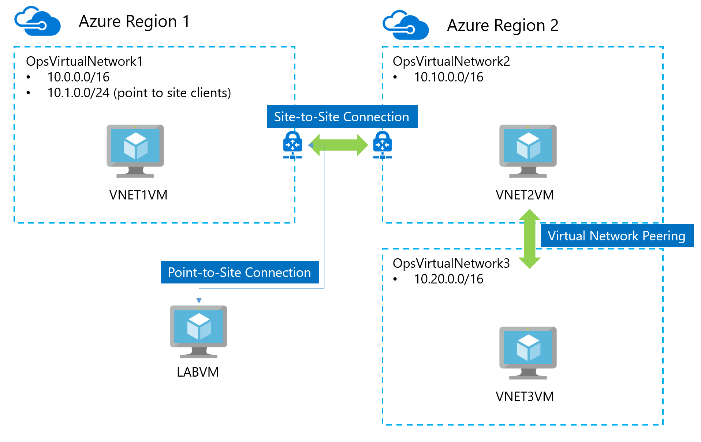

Time Estimate
-------------

2 to 3 hours

Exercise 1: Create a VM in a Virtual Network 
=============================================

Overview
--------

In this exercise, you will create a virtual machine and a virtual network in a
region. This virtual network and virtual machine will be used as the source to
connect to a virtual machine and virtual network in a remote region.

Time Estimate
-------------

30 minutes

Task 1: Login to the Azure Management Portal
--------------------------------------------

1.  From within the RDP session (**LABVM**), open Internet Explorer and navigate
    to <https://portal.azure.com> and authenticate with your Organization or
    Microsoft Account by selected the correct link.

>   [./media/image2.png](./media/image2.png)

Task 2: Create an Azure Virtual Network
---------------------------------------

1.  Click **New**, **Networking**, and then click **Virtual Network**.

    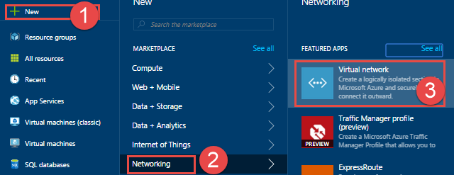

2.  Leave the deployment model at **Resource Manager** and click **Create**.

    

3.  Specify the following configuration:

| Name: **OpsVirtualNetwork1** | [./media/image5.png](./media/image5.png) |
|------------------------------|------------------------------------------|

-   Address space: **10.0.0.0/16**

-   Subnet name: **Apps**

-   Subnet address range: **10.0.0.0/24**

-   Resource Group: **OpsVNETRmRG**

-   Location: **Select a region different than the one you used for the lab
    virtual machine.**

You may see a warning like this when creating the virtual network. This is just
letting you know that you cannot connect these two virtual networks later using
a site-to-site or ExpressRoute connection because the address range overlaps.
You can ignore this warning.

1.  Check the box **Pin to dashboard** and click **Create** to create the
    virtual network.

    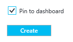

Task 3: Add a New Subnet
------------------------

In this task, you will learn how to add an additional subnet to the virtual
network.

1.  After the virtual network is created, click the **Subnets** link under
    **SETTINGS**.

    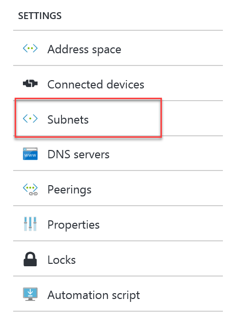

2.  Click **Subnet +**

    

3.  Specify the following configuration on the new subnet and click **OK**.

    1.  Name: **Data**

    2.  Address Space: **10.0.1.0/24**

        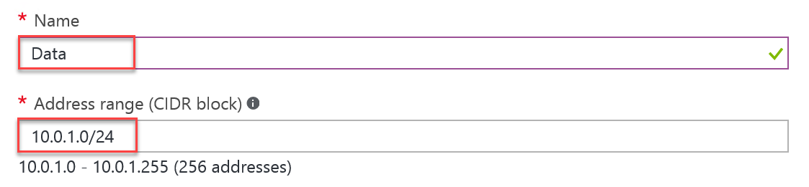

        You should have two subnets with following address ranges:

        

Task 4: Create a Virtual Machine in the Virtual Network
-------------------------------------------------------

In this task, you will create a virtual machine in the virtual network and
specify the subnet it will be deployed to.

1.  Click **New**, **Compute**, and then select the **Windows Server 2016
    Datacenter** image from the FEATURED APPS list.

    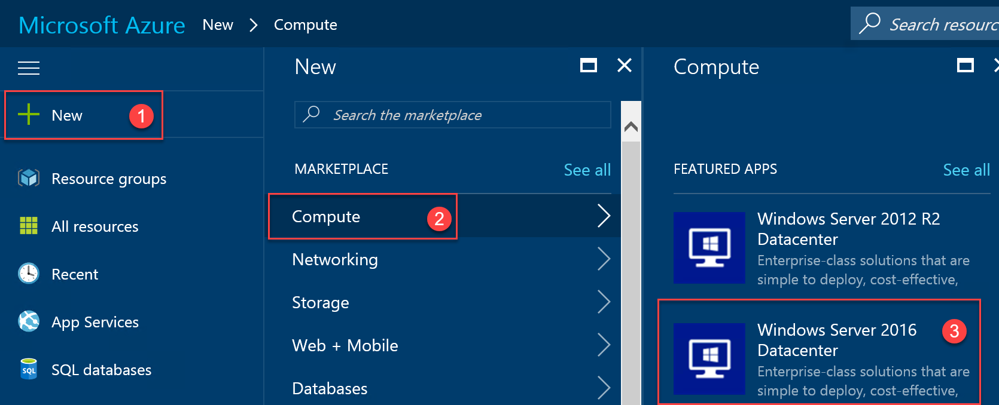

2.  Leave the deployment model set to **Resource Manager** and click **Create**.

    

3.  Specify the following configuration and click **OK**.

| Name: **VNET1VM** | [./media/image13.png](./media/image13.png) |
|-------------------|--------------------------------------------|

-   VM disk type: **SDD**

-   User name: **demouser**

-   Password: **demo\@pass123**

-   Subscription: **Ensure the correct subscription is selected**

-   Resource Group: **OpsVMRmRG**

-   Location: **the same region selected for the Azure Virtual Network**

1.  Choose **DS1_V2** and then click **Select** at the bottom of the page.

Note: You may have to click View All to see this option.

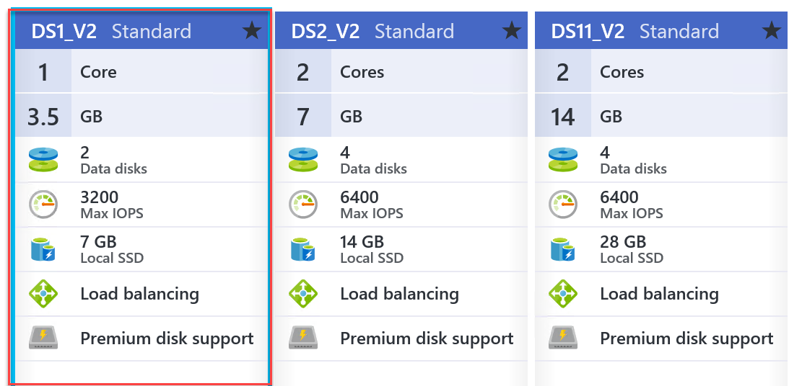

1.  Click Configure required settings to specify a storage account for your
    virtual machine.

Note: You could optionally select Use managed disks instead, if that feature is
available in your region.

>   [./media/image15.png](./media/image15.png)

1.  Click **+ Add.**

>   [./media/image16.png](./media/image16.png)

1.  Specify a unique name for the storage account (all lower letters and
    alphanumeric characters) and ensure the green checkmark shows the name is
    valid.

    

2.  Click **OK** to continue.

>   [./media/image18.png](./media/image18.png)

1.  Click Configure required settings for the Diagnostics storage account.
    Repeat the same steps to select a unique storage account name. This storage
    account will hold diagnostic logs about your virtual machine that you can
    use for troubleshooting purposes.

>   [./media/image19.png](./media/image19.png)

1.  Specify the following configuration options:

    -   Virtual network: Click the Virtual Network tile to change it to
        **OPSVirtualNetwork1** (if it is not already selected).

    -   Subnet: Click the Subnet tile to change it to the **Apps** subnet (if it
        is not already selected)

        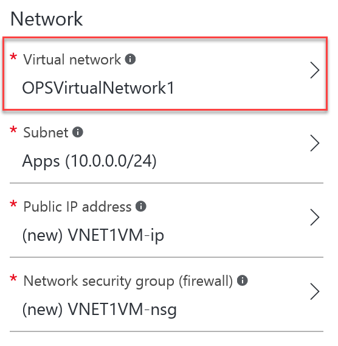

2.  Click **OK** until all blades are closed and the virtual machine starts to
    provision.

Summary
-------

In this exercise, you created a virtual network that will be used for several of
the hands on labs in this course. You then created a virtual machine and
specified the virtual network configuration and the availability set for the
virtual machine.

Exercise 2: Connecting Azure Regions
====================================

Overview
--------

In this exercise, you will create a new virtual network in a second region and
establish connectivity between the regions using a site-to-site virtual private
network (VPN).

Time Estimate
-------------

90 minutes

Task 1: Create the Remote Virtual Network
-----------------------------------------

In this task, you will create a virtual network in a second Azure region.

1.  Using the Azure Management Portal, click **New**, **Networking**, and
    **Virtual network**.

    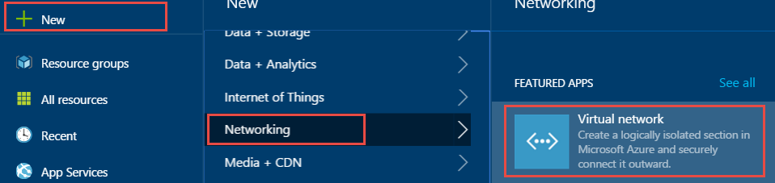

2.  Accept the default value of **Resource Manager**, and click **Create**.

    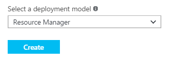

3.  Specify the following configuration:

| Name: **OpsVirtualNetwork2** | [./media/image23.png](./media/image23.png) |
|------------------------------|--------------------------------------------|

-   Address space: **10.10.0.0/16**

-   Subnet name: **Apps**

-   Subnet address range: **10.10.0.0/24**

-   Subscription: **Choose your Subscription**

-   Resource Group: **OpsVNETRemoteRG**

-   Location: **Specify a remote region from the region you are currently
    using.**

**Make sure this is NOT the same location you have specified in the previous
labs.**

1.  Check **Pin to dashboard,** and then click **Create** to create the new
    virtual network.

    

Task 2: Configure Subnet Gateways for both virtual networks
-----------------------------------------------------------

In this task, you will add additional subnets to the virtual networks. Each
virtual network will require a gateway for VPN connectivity. The VPN Gateway
requires its own subnet to allocate addresses from.

1.  On the **OpsVirtualNetwork2** virtual network configuration blade, click
    **Subnets** and then click **+Gateway subnet**.

    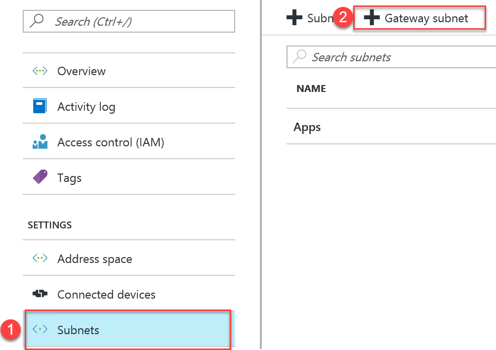

2.  Specify the following configuration for the subnet and click **OK**.

    -   Name: **GatewaySubnet**

    -   Address range: **10.10.1.0/29**

        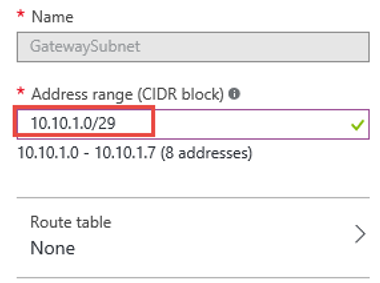

3.  Open the **OpsVirtualNetwork1** configuration blade by clicking **More
    services**, **Virtual Networks**, and clicking on **OpsVirtualNetwork1**.

4.  On the **OpsVirtualNetwork1** virtual network configuration blade, click
    **Subnets** and then click **+Gateway subnet**.

    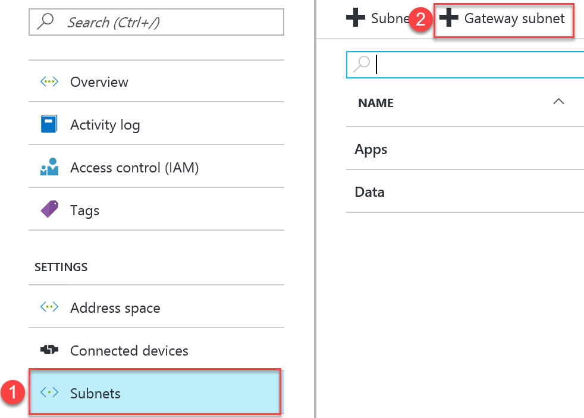

5.  Specify the following configuration and click **OK.**

    -   Name: **GatewaySubnet**

    -   Address range: **10.0.2.0/29**

        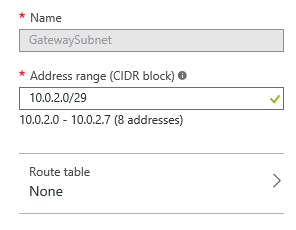

Task 3: Create the First Gateway
--------------------------------

In this task, you will create the VPN gateway for the first virtual network.

1.  Using the Azure Management Portal, click **More services**, **Virtual
    Network Gateways**.

2.  Click the **Add** button on the toolbar.

    

3.  Name the gateway **OPSGW1**.

    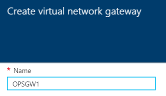

4.  Select the region the **OpsVirtualNetwork1** is deployed to.

    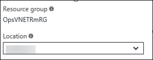

5.  Click the **Choose a virtual network tile**, and select
    **OpsVirtualNetwork1**.

    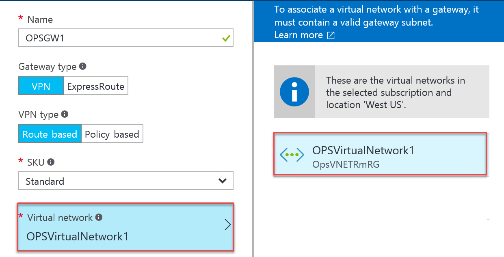

6.  Click the **Public IP address** tile, and click **Create new**.

    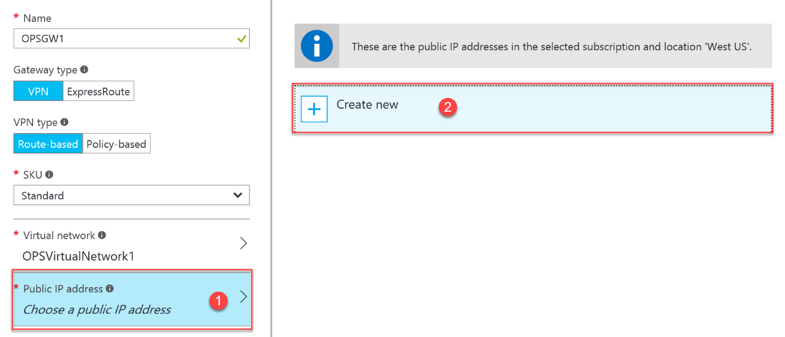

7.  Name the IP **OPSGW1IP** and click **OK**.

    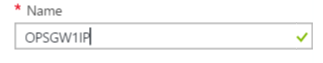

8.  Click the **Create** button at the bottom of the blade to start the
    provisioning of the gateway.

Task 4: Create the Second Gateway
---------------------------------

In this task, you will create the second VPN Gateway.

1.  Using the Azure Management Portal, click **More services**, **Virtual
    Network Gateways**.

2.  Click the **Add** button on the toolbar.

    

3.  Name the gateway **OPSGW2**.

    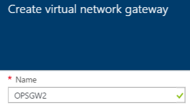

4.  Select the region the **OpsVirtualNetwork2**is deployed to.

    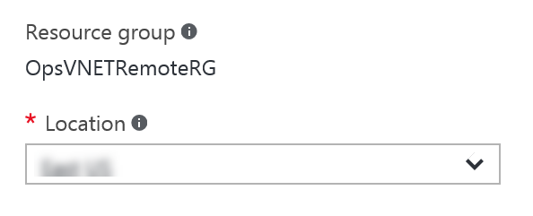

5.  Click **Choose a virtual network**, and select **OpsVirtualNetwork2**.

    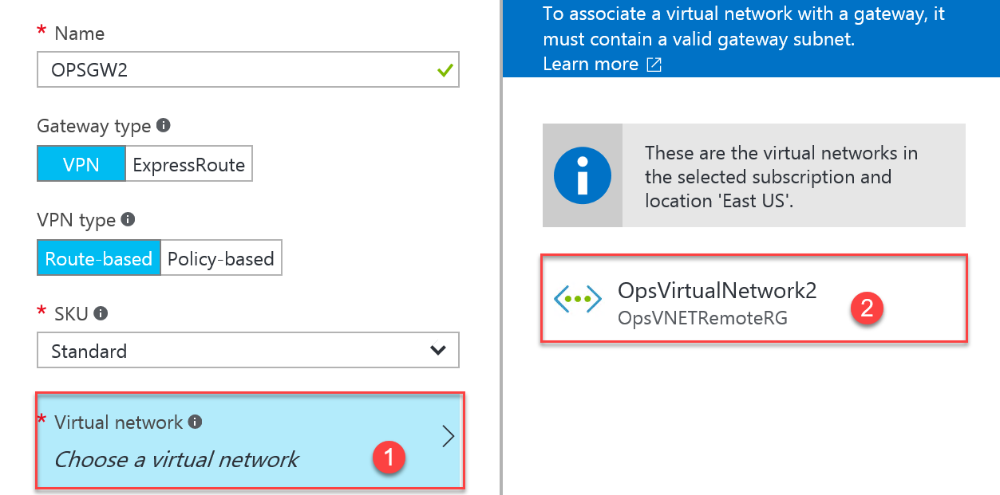

6.  Click the **Public IP address** tile, and click **Create new**.

    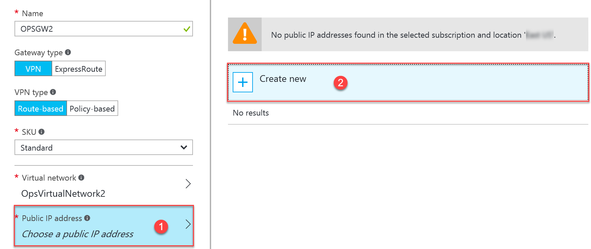

7.  Name the IP **OPSGW2IP** and click **OK**.

    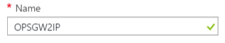

8.  Click the **Create** button at the bottom of the blade to start the
    provisioning of the gateway.

Note: It may take up to 60 minutes to provision both gateways. At this point you
should come back and continue the lab after the gateways are provisioned.

1.  The Azure Portal will notify you when the deployments have completed.

    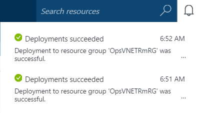

Proceed through Exercise 5 while waiting on the gateways to be provisioned.

Task 5: Create a VM to Validate Connectivity
--------------------------------------------

In this task, you will create a virtual machine in the second virtual network
that will be used to test connectivity across the VPN tunnel.

1.  Create a new Virtual Machine in the second virtual network by clicking
    **New**, **Virtual Machines**, and **Windows Server 2016 Datacenter**.

    

2.  Accept the default setting of **Resource Manager** and then click
    **Create**.

    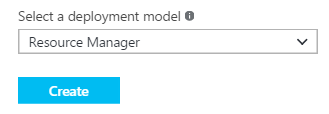

3.  Specify the following configuration, and click **OK**.

| Name: **VNET2VM** | [./media/image41.png](./media/image41.png) |
|-------------------|--------------------------------------------|

-   VM disk type: **SSD**

-   User name: **demouser**

-   Password: **demo\@pass123**

-   Resource Group: **OpsVMRmRG**

-   Location: **the region you created the OpsVirtualNetwork2 virtual network
    in.**

1.  Choose **DS1_V2 Standard** and click **Select**.

>   [./media/image42.png](./media/image42.png)

1.  Click Configure required settings to specify a storage account for your
    virtual machine.

Note: You could optionally select Use managed disks instead, if that feature is
available in your region.

>   [./media/image15.png](./media/image15.png)

1.  Click **+ Add.**

>   [./media/image16.png](./media/image16.png)

1.  Specify a unique name for the storage account (all lower letters and
    alphanumeric characters) and ensure the green checkmark shows the name is
    valid.

    

2.  Click **OK** to continue.

>   [./media/image18.png](./media/image18.png)

1.  Click Configure required settings for the Diagnostics storage account.
    Repeat the same steps to select a unique storage account name. This storage
    account will hold diagnostic logs about your virtual machine that you can
    use for troubleshooting purposes.

>   [./media/image19.png](./media/image19.png)

1.  On the Settings blade, change the Virtual network to **OpsVirtualNetwork2**,
    and set the subnet to the default subnet named: **default**.

    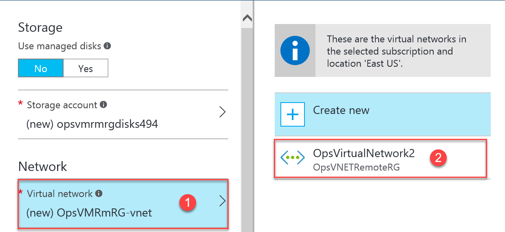

2.  Click **OK**, and then click **OK** again to provision the virtual machine.

Task 6: Connect the Gateways
----------------------------

In this task, you will connect the gateways and establish the VPN tunnel.

1.  Check the notifications area first to ensure both gateways are provisioned
    prior to continuing.

    

2.  Using the Azure Management Portal, click **New**, and type in
    **Connection**, and press **enter**.

    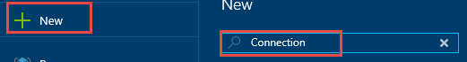

3.  Click **Connection**, and then click **Create**.

    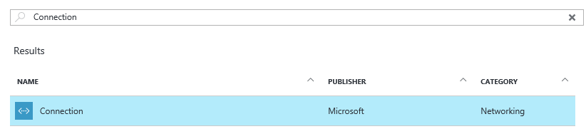

4.  Select the existing **OpsVMRmRG** resource group. Then **change the
    location** of this connection to the Azure region the **OpsVirtualNetwork1**
    virtual network is deployed to. Click **OK**.

    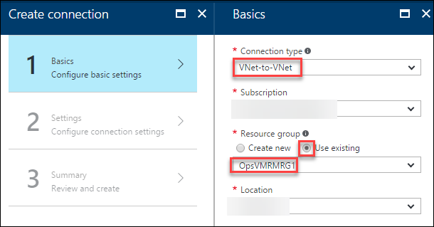

5.  On the Settings tab, select **OPSGW1** for the first virtual network
    gateway, and **OPSGW2** for the second virtual network gateway. Enter the
    shared key: **A1B2C3D4**, and click **OK**.

    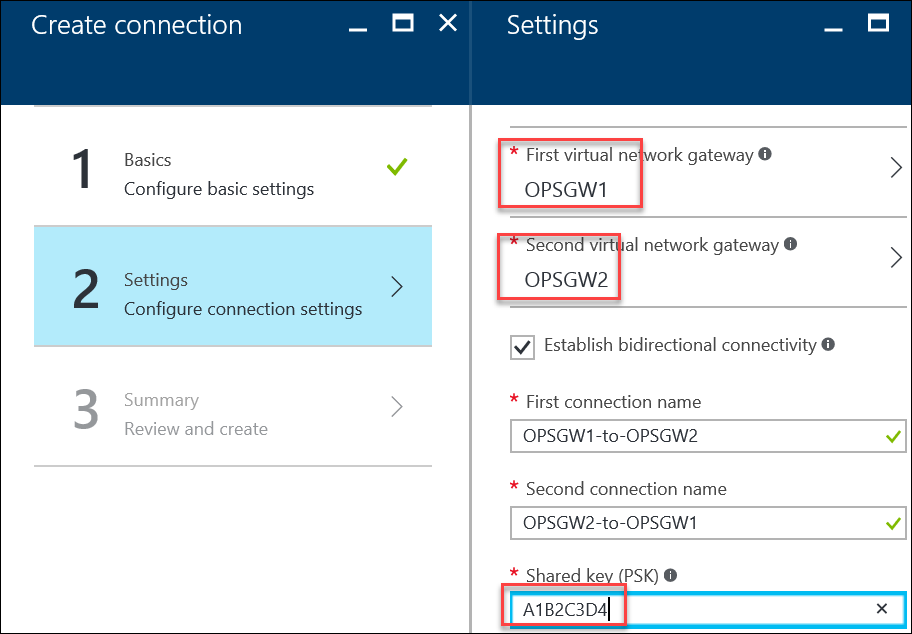

6.  Click **OK** on the Summary page to create the connection.

7.  Using the Azure Management Portal, click **More services, Connections.**
    Watch the progress of the connection status and use the **Refresh** icon
    until the status changes for both connections from **Updating** to
    **Succeeded** and then **Unknown** to **Connected**.

    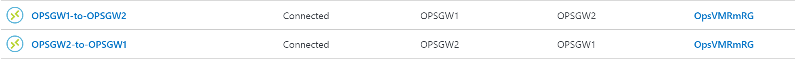

Task 7: Validate Connectivity 
------------------------------

In this task, you will connect to a virtual machine in the second virtual
network from a virtual machine in the first virtual network using a private IP
address. This will validate that the virtual networks are connected using the
VPN connection.

1.  Click on **More services**, **Virtual Machines** and click the new virtual
    machine **VNET2VM**.

    

2.  Click the **Network Interfaces** link beneath SETTINGS.

    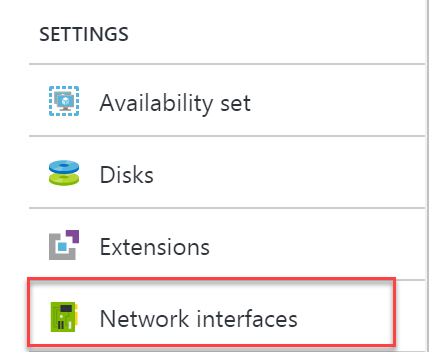

3.  Copy the private IP address to the clipboard or paste it to a notepad for
    later reference, this IP will be used to connect from the first virtual
    machine.

    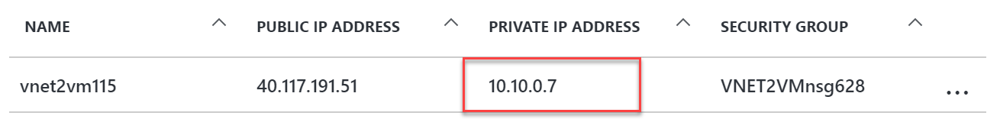

4.  Click on **More services**, **Virtual Machines**, and click on the
    **VNET1VM** virtual machine.

    

5.  Click on **Connect,** and login using the credentials specified when
    creating the virtual machine:

    1.  User name: **demouser**

    2.  Password: **demo\@pass123**

        

        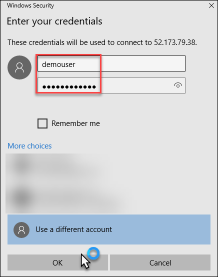

6.  From within **VNET1VM**, click the Windows icon and then click the Remote
    Desktop icon.

    

    

7.  Specify the private IP for **VNET2VM** and click **Connect**. Enter the
    credentials for the virtual machine when prompted:

    1.  User name: **demouser**

    2.  Password: **demo\@pass123**

        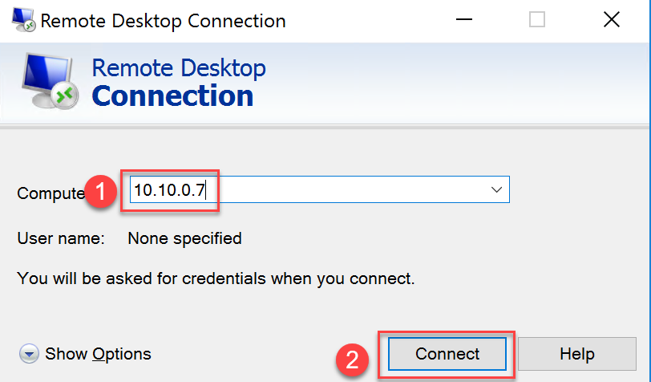

Connecting to the virtual machine validates that the tunnel is working correctly
and you are connecting over the VPN tunnel between sites.

Summary
-------

In this exercise, you created a new virtual network in a remote region and
established connectivity between the regions using a site-to-site virtual
private network (VPN).

Exercise 3: Configuring Point-to-Site
=====================================

Overview
--------

In this exercise, you will configure your lab virtual machine to connect to a
virtual network using a point-to-site connection. This scenario is ideal for
requirements that require an individual computer to connect securely over the
Internet to resources running in an Azure Virtual Network.

Time Estimate
-------------

30 minutes

1.  Launch a command prompt from within the **LABVM** virtual machine and then
    execute the following commands:

CD C:\\

MKDIR OpsgilityTraining

CD OpsgilityTraining

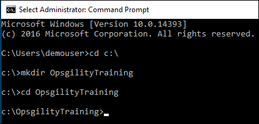

1.  Download the student files zip from the lab guide in
    [www.opsgility.com](http://www.opsgility.com) to the
    **C:\\OpsgilityTraining** folder. Extract the contents to the same folder.

    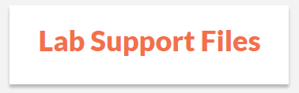

    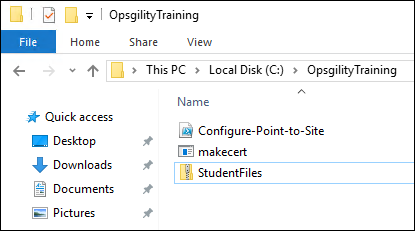

2.  Execute the following command to generate a root certificate for configuring
    a point-to-site VPN gateway.

makecert -sky exchange -r -n "CN=P2SROOT" -pe -a sha1 -len 2048 -ss My
.\\P2SRoot.cer

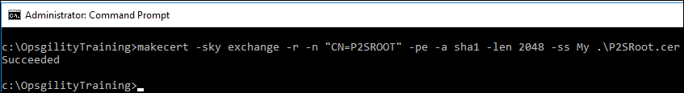

1.  Execute the following command to generate a client certificate:

makecert.exe -n "CN=P2SClient" -pe -sky exchange -m 96 -ss My -in "P2SRoot" -is
my -a sha1

1.  Using **File Explorer**, navigate to the **C:\\OpsgilityTraining** folder
    and double-click the **P2SRoot.cer** file.

    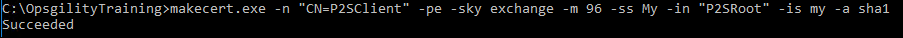

2.  Click the **Details** tab of the certificate.

    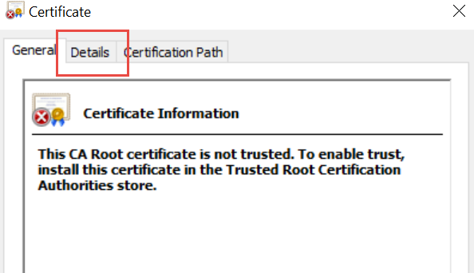

3.  Click **Copy to File**

    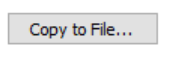

4.  Click **Next**, then change the encoding type to **Base-64 encoded X.509
    (.CER)** and click **Next**.

    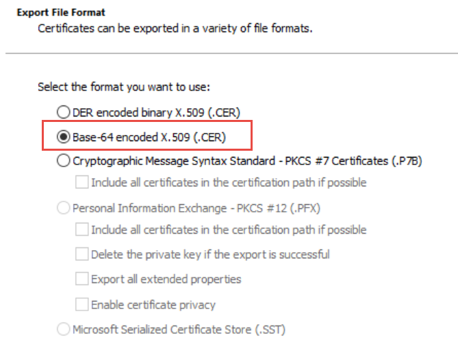

5.  Specify the filename as **C:\\OpsgilityTraining\\PublicKeyFile.** Click
    **Next** and **Finish**.

    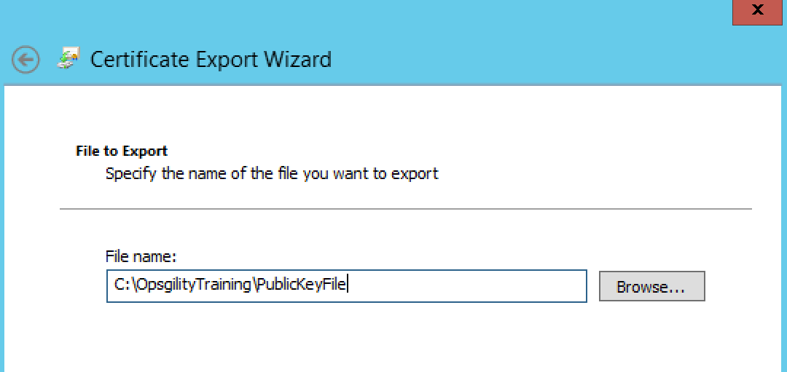

Task 1: Configure the VPN gateway 
----------------------------------

In this exercise, you will execute a PowerShell script that uses the Azure
PowerShell cmdlets to configure the VPN Gateway for client connectivity by
adding an additional address space. This script will also upload a certificate
that you will create in the exercise, and finally it will generate a VPNClient
package that you can then install on your client computer (along with the
certificate) to use point-to-site.

1.  Using File Explorer, right click on the **Configure-Point-to-Site.ps1**
    PowerShell script and click **Edit**.

2.  Review the comments in the PowerShell code to understand what it is doing.

3.  Open the file **C:\\OpsgilityTraining\\PublicKeyFile.cer** created earlier
    in notepad.

4.  Copy ALL of the values between “-----BEGIN CERTIFICATE-----“ and “-----END
    CERTIFICATE-----“ to the clipboard.

    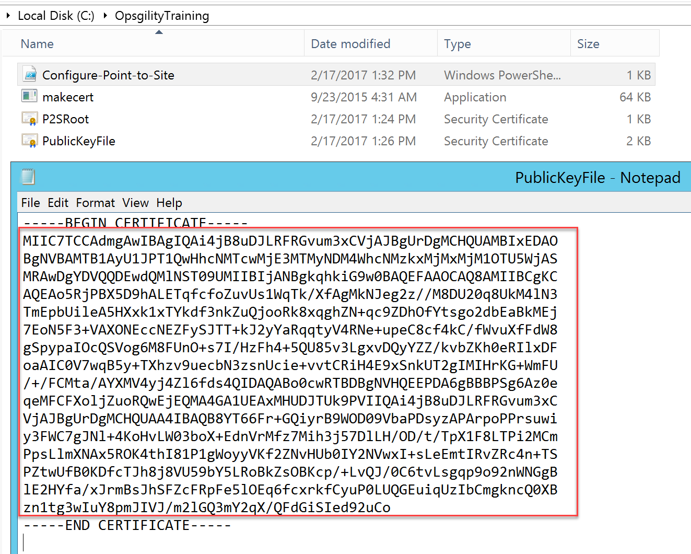

5.  Within the PowerShell ISE identify the following code and replace the entre
    value between quotes with the copied data.

    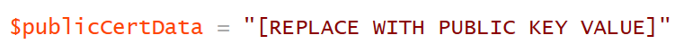

    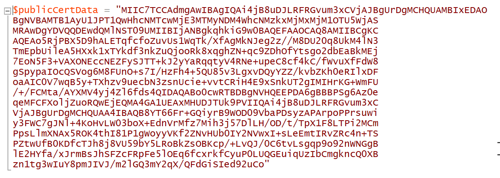

6.  In the Console Pane of the PowerShell ISE execute the following command to
    login to Azure from PowerShell. When prompted login with the credentials for
    your Azure subscription.

Login-AzureRmAccount

1.  If your credentials are associated with multiple subscriptions, you can
    switch subscriptions by using the **Get-AzureRmSubscription** cmdlet to
    retrieve the Subscription ID and then use the **Select-AzureRmSubscription**
    cmdlet to select the subscription where your virtual network is created at.

    Example of multiple subscriptions:

    

    Example of selecting a subscription:

    

2.  Click the Green Arrow to execute the script.

    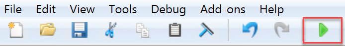

3.  After the script executes run the following command to install the VPN
    client.

    

Note: The makecert.exe commands used earlier automatically install the client
certificate on the lab machine. To do this on a separate machine you would need
to create a new client certificate, export, and install the certificate on the
machine in addition to the VPNClient.exe install.

Task 2: Validate Client Connectivity with Point-to-Site
-------------------------------------------------------

In this task, you will validate that you can connect from the lab machine to the
virtual network using private IP addresses.

1.  The client computer should now have a new connection option in the same
    location as new wireless connections. Click the **OPSVirtualNetwork1** icon
    to launch the connection.

    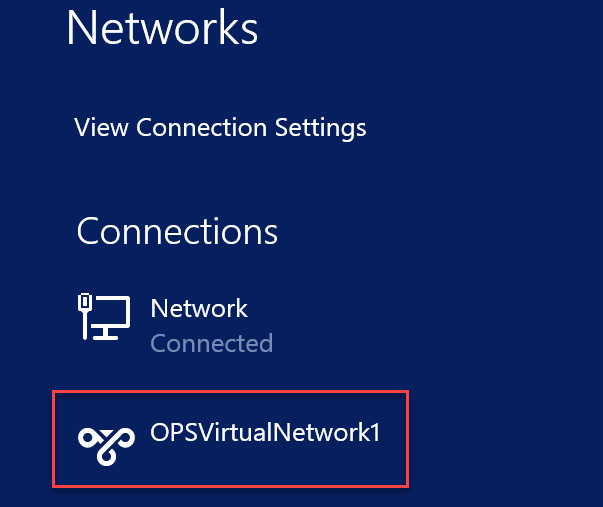

2.  On the Setting Menu click **OpsVirtualNetwork1**, then click **Connect** to
    initiate connection.

    

3.  On the Windows Azure, Virtual Network dialog box, click **Connect**.

    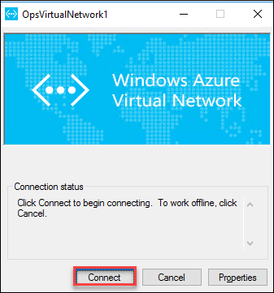

4.  If you receive a message requesting elevated privilege to run, Select **Do
    not show this message again for this Connection** and click **Continue** and
    then click **Connect** again.

    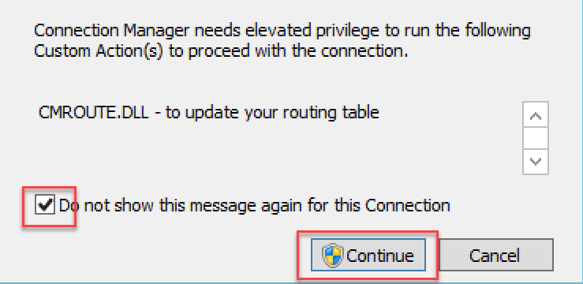

NOTE: The dialog box will disappear when the connection is completed.

1.  Click again in the connections are of the LABVM, and note the machine is in
    the “Connected” state.

    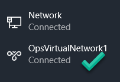

2.  From within **LABVM**, click the Windows icon and then click the Remote
    Desktop icon.

    

    

3.  In the remote desktop client, enter the IP address **10.0.0.4** to connect
    to the virtual machine’s private IP address. If you are prompted to login
    after clicking **Connect** you have validate private connectivity using the
    point-to-site connection.

    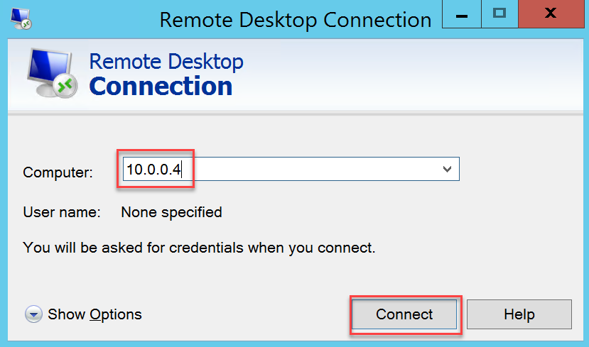

Summary
-------

In this exercise, you have configured your lab virtual machine to connect to a
virtual network using a point-to-site connection.

Exercise 4: Configuring Virtual Network Peering
===============================================

Overview
--------

In this exercise, you will create a new virtual network in the same region as
the second virtual network and configure direct peering for connectivity.

Time Estimate
-------------

30 minutes

Task 1: Create the Virtual Network
----------------------------------

In this task, you will create a third virtual network in the same region as the
second.

1.  Using the Azure Management Portal, click **New**, **Networking**, and
    **Virtual network**.

    

2.  Accept the default value of **Resource Manager**, and click **Create**.

    

3.  Specify the following configuration:

| Name: **OpsVirtualNetwork3** | [./media/image82.png](./media/image82.png) |
|------------------------------|--------------------------------------------|

-   Address space: **10.20.0.0/16**

-   Subnet address range: **10.20.0.0/24**

-   Subscription: **Choose your Subscription**

-   Resource Group: **OpsVNETRemoteRG**

-   Location: **Specify the same region as OpsVirtualNetwork2.**

1.  Check **Pin to dashboard,** and then click **Create** to create the new
    virtual network.

    

Task 2: Allow Gateway Transit
-----------------------------

In this task, you will configure the gateway for OpsVirtualNetwork2 to allow
traffic from OpsVirtualNetwork3 to flow (transit) over its gateway.

1.  Open the configuration for **OpsVirtualNetwork2** by clicking **More
    services**, **Virtual Networks**.

2.  After the virtual network, has provisioned, click the **Peerings** link
    under **SETTINGS**.

    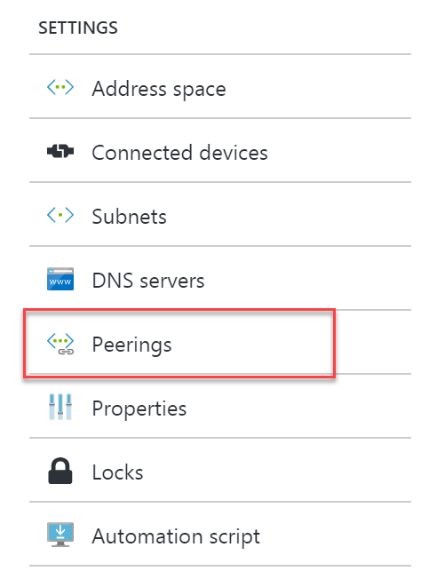

3.  Click the **+ Add** button.

    

4.  Specify the name **OPSVNET2Peering**, and select the **OPSVirtualNetwork3**
    virtual network.

    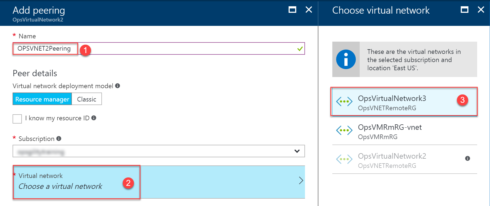

5.  Check the boxes for **Allow forwarded traffic** and **Allow gateway
    transit** and click **OK**.

    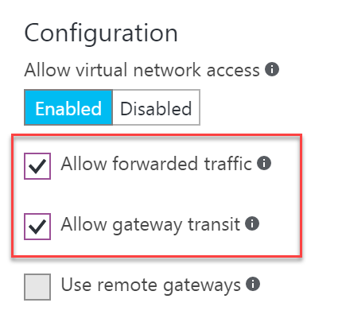

**Allow forwarded traffic:** This setting allows the peer’s forwarded traffic
(traffic not originating from inside the peer virtual network) into your virtual
network.

**Allow Gateway transit:** Allows the peer virtual network to use your virtual
network gateway. The peer virtual network cannot already have a gateway
configured, and must select ‘use remote gateway’ in its peering settings.

1.  Open the configuration for **OpsVirtualNetwork3** by clicking **More
    services**, **Virtual Networks**.

2.  Click the **Peerings** link under **SETTINGS**.

    

3.  Click the **+ Add** button.

    

4.  Specify the name as OPSVNET2Peering, and select the OpsVirtualNetwork2
    virtual network as the peer.

    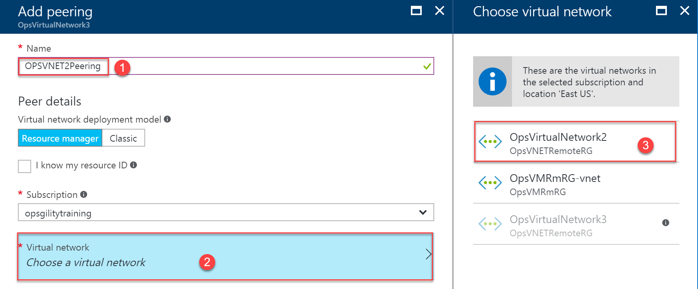

5.  Check the **Allow forwarded traffic** and **Use remote gateways** checkboxes
    and click **OK**.

    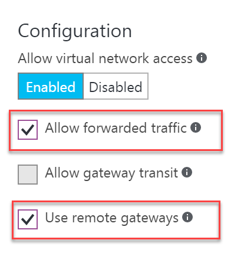

**Use remote gateways:** this setting allows the virtual network to forward
traffic using the peered virtual networks gateway.

Task 3: Create a VM to Validate Connectivity
--------------------------------------------

In this task, you will deploy another virtual machine to validate connectivity
from the third subnet using peering and VPN Gateway transit traffic.

1.  Create a new Virtual Machine in the second virtual network by clicking
    **New**, **Virtual Machines**, and **Windows Server 2016 Datacenter**.

    

2.  Accept the default setting of **Resource Manager** and then click
    **Create**.

    

3.  Specify the following configuration, and click **OK**.

| Name: **VNET3VM** | [./media/image89.png](./media/image89.png) |
|-------------------|--------------------------------------------|

-   VM disk type: **SSD**

-   User name: **demouser**

-   Password: **demo\@pass123**

-   Resource Group: **OpsVMRmRG**

-   Location: **the region you created the OpsVirtualNetwork3 virtual network
    in.**

1.  Choose **DS1_V2 Standard** and click **Select**.

>   [./media/image42.png](./media/image42.png)

1.  Click Configure required settings to specify a storage account for your
    virtual machine.

Note: You could optionally select Use managed disks instead, if that feature is
available in your region.

>   [./media/image15.png](./media/image15.png)

1.  Click **+ Add.**

>   [./media/image16.png](./media/image16.png)

1.  Specify a unique name for the storage account (all lower letters and
    alphanumeric characters) and ensure the green checkmark shows the name is
    valid.

    

2.  Click **OK** to continue.

>   [./media/image18.png](./media/image18.png)

1.  Click Configure required settings for the Diagnostics storage account.
    Repeat the same steps to select a unique storage account name. This storage
    account will hold diagnostic logs about your virtual machine that you can
    use for troubleshooting purposes.

>   [./media/image19.png](./media/image19.png)

1.  On the Settings blade, change the Virtual network to **OpsVirtualNetwork3**,
    and set the subnet to the default subnet named: **default**.

    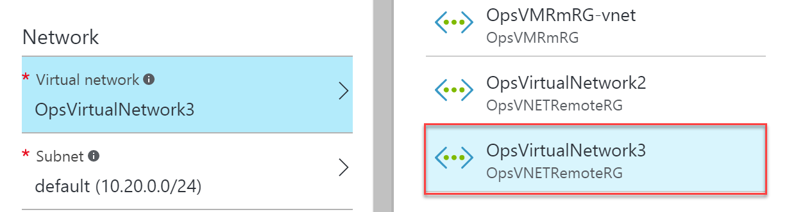

2.  Click **OK**, and then click **OK** again to provision the virtual machine.

3.  After the virtual machine is provisioned, click the Connect button and login
    using the following credentials:

    1.  User name: **demouser**

    2.  Password: **demo\@pass123**

4.  Launch the remote desktop client and attempt to connect to the virtual
    machine in the remote region (**OpsVirtualNetwork1**).

    1.  10.0.0.4 – **VNET1VM** (traffic will flow over the site-to-site through
        the peer)

Exercise 5: Free Resources in your Subscription
===============================================

In this exercise, you will delete the resource groups for the resources you
created in this lab. This will delete all the artifacts created in Azure for
this lab.

Time Estimate
-------------

5 minutes

1.  In the Azure Management portal, click **Resource Groups**.

    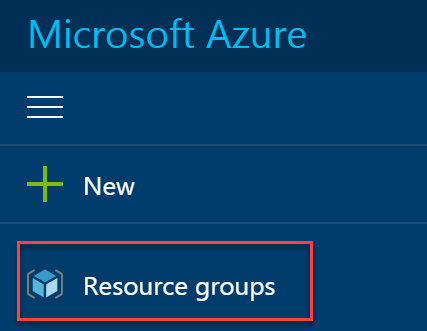

2.  Open the **OpsVMRmRG** resource group.

    

3.  Click the **Delete** button to delete the resource group. When prompted type
    in the name of the resource group to confirm.

    

4.  Repeat the process for the following resource groups (in order):

    1.  OpsVNETRemoteRG

    2.  OpsVNETRmRG

    3.  OPSLABRG
